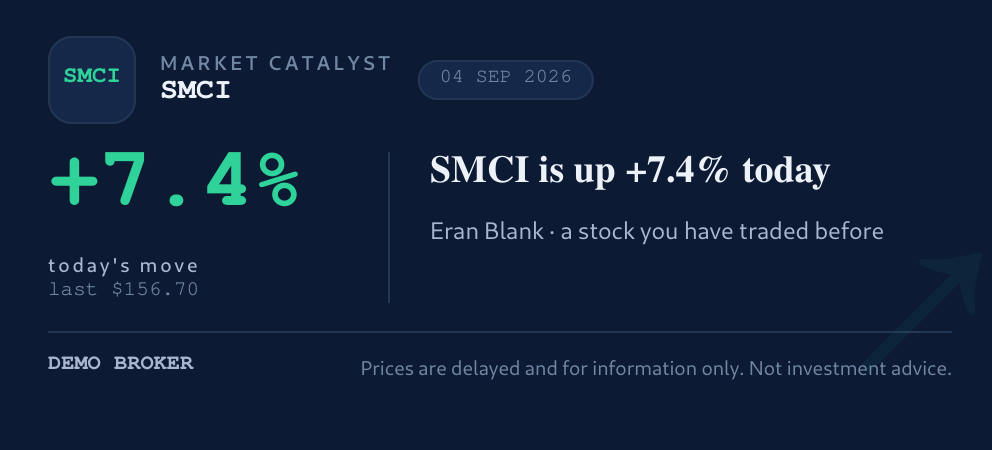
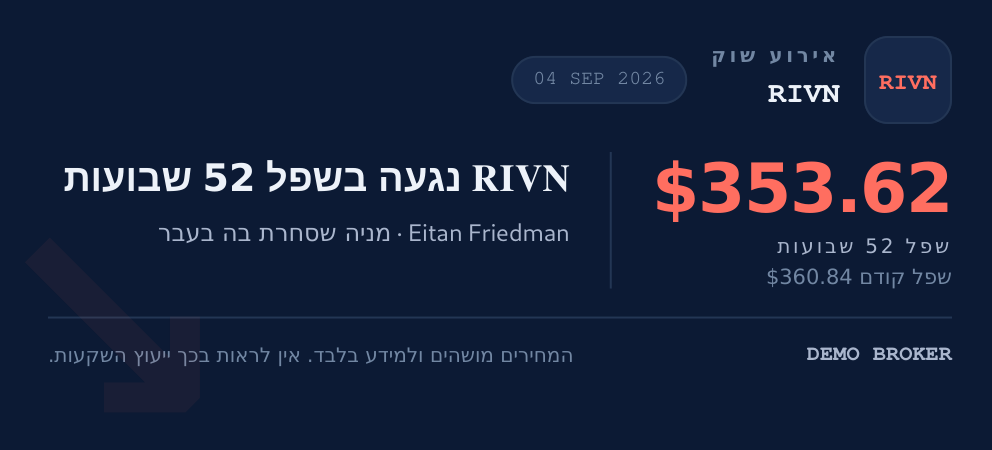
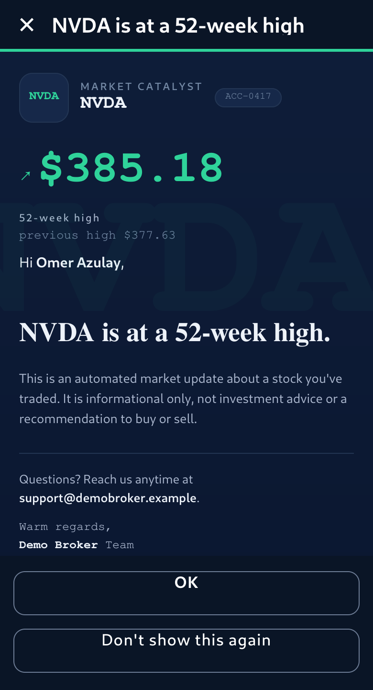
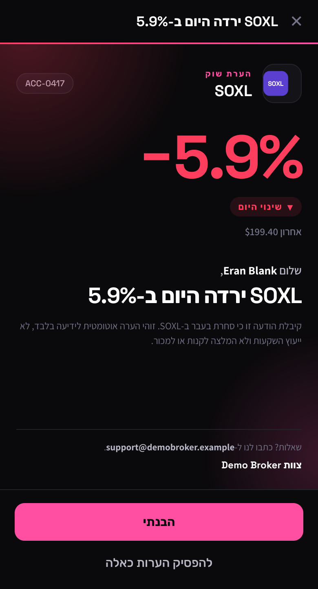
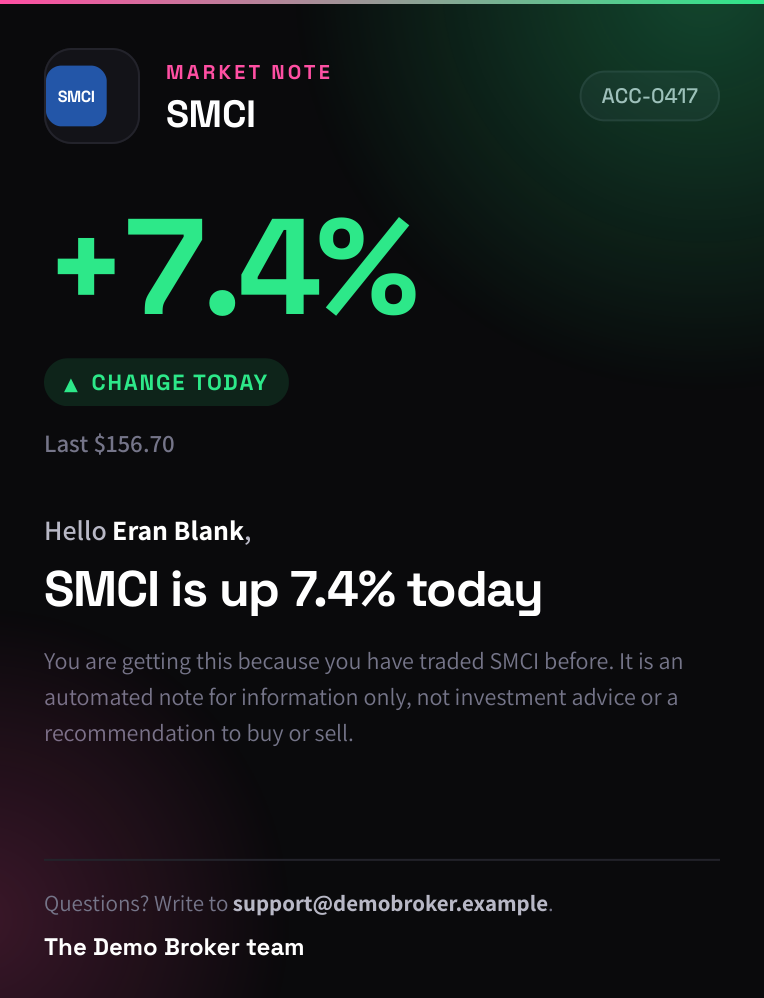
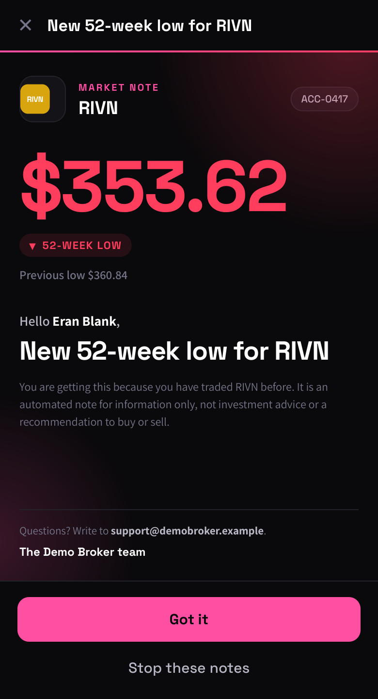
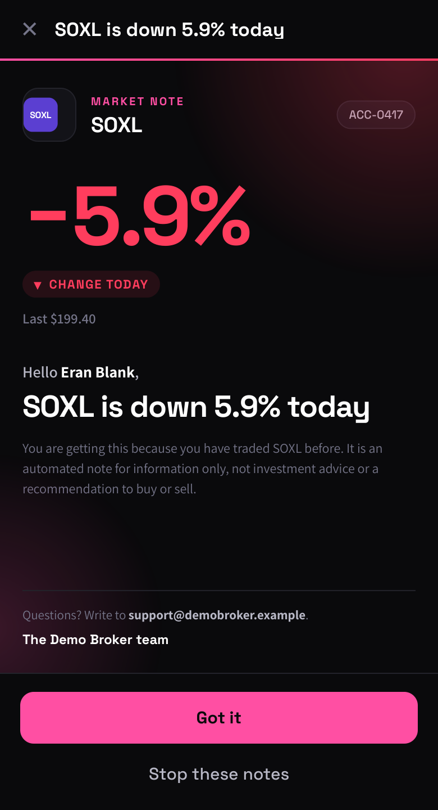
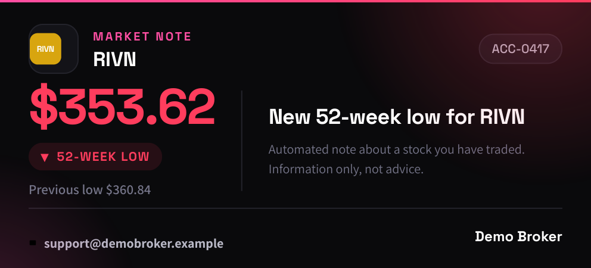
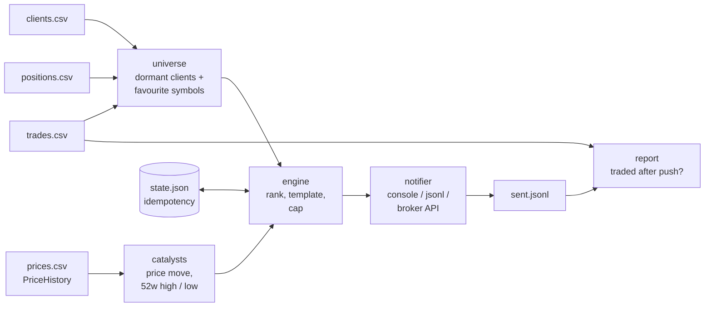

# Catalyst Engine

Re-engage dormant brokerage clients by telling them, in their own language, that
a stock they care about is doing something today.

Every trading day the engine finds clients who have gone quiet, works out which
symbols each of them has traded or still holds, checks those symbols for a market
catalyst (a large daily move, a 52-week high or low), and sends at most one
personalised notification per client per day. The next day it reports who traded
after being nudged.

This is a clean-room demo of a system I built and run in production at an online
brokerage. The code here is written from scratch, runs on synthetic data, and has
no dependency on any database, market-data vendor or messaging API. Those are the
seams described in [How this runs in production](#how-this-runs-in-production).

```
$ python -m catalyst_demo run --date 2026-09-04 --dry-run
DRY RUN 2026-09-04: 136 dormant clients, 6/37 symbols with a catalyst, 42 would be sent, 0 suppressed
       305,069  ACC-0188  RIVN הגיע לשפל 52 שבועות
        47,023  ACC-0066  TSLA הגיע לשיא 52 שבועות
        41,897  ACC-0014  NVDA hit a 52-week high
        32,219  ACC-0050  SMCI moved +7.4% today
        30,073  ACC-0024  RIVN hit a 52-week low
```

## What the client sees

The message is rendered as a card inside the trading platform's popup, in the
client's language. One accent colour follows direction, and the focal number is
the only thing that changes with the news. No call to action, no advice.

<p>
  
  
</p>
<p>
  
  
  
</p>
<p>
  
  
  
</p>

The first two are the full phone popup: platform title bar, greeting, disclaimer,
support line, sign-off and buttons. The third is the card on its own, as embedded
in a desktop popup. The last row shows the same RIVN and SOXL alerts in English,
so the two languages can be compared side by side. Black surface, white type, pink for the brand, green for a good
catalyst and red for a bad one. Space Grotesk carries the headline and the focal
number, Assistant the rest (Google Fonts, with system fallbacks), and a coloured
ticker tile stands in for a company logo.

`catalyst_demo/card.py` renders these from a `Notification` (`render_card` for the
card, `render_popup` for the phone popup); `scripts/render_cards.py` writes the
samples in `docs/cards/` as HTML, and as PNG when WeasyPrint is installed.

## Run it

Python 3.9 or newer, no third-party packages.

```bash
git clone https://github.com/Eran533/catalyst-engine-demo
cd catalyst-engine-demo
pip install -e .[dev]                     # only pytest, for the tests
pytest -q                                 # 34 tests

python -m catalyst_demo run --date 2026-09-04 --dry-run   # plan only
python -m catalyst_demo run --date 2026-09-04             # send (to the console + data/sent.jsonl)
python -m catalyst_demo run --date 2026-09-04             # again: everything suppressed
python -m catalyst_demo report --date 2026-09-04          # who traded after the push
```

The committed `data/` folder is a synthetic set of 200 clients, 8,000 trades and
16 months of prices for 37 symbols, generated by `scripts/make_demo_data.py`
with a fixed seed. A few catalysts are scripted onto the last trading day so the
first run has something to show. Regenerate with a different seed or size:

```bash
python scripts/make_demo_data.py --seed 11 --clients 500
```

## How it works



One run, in order:

1. **Universe** (`universe.py`). A client is dormant when their last trade is at
   least 7 trading days ago. Their favourites are every symbol they currently hold,
   plus the two they traded most in the past year. Clients who never traded have no
   favourites and are skipped.
2. **Catalysts** (`catalysts.py`). Detection runs once per symbol, not once per
   client. A daily move of 4% or more is a catalyst. A close strictly above the
   trailing 252-day high, or below the low, is a catalyst. With fewer than 30
   closes of history the extreme check is skipped rather than guessed.
3. **Ranking** (`engine.py`). A client with several catalysts gets the headline
   one: a 52-week extreme beats any price move, then the larger move wins. Clients
   are scored by balance times catalyst strength so, when the daily send budget is
   capped, the accounts most worth re-engaging go first.
4. **Idempotency** (`state.py`). One notification per client per day, and the same
   (client, symbol, catalyst) is not repeated inside the cooldown. State is written
   atomically. It is recorded only after a successful delivery, so a failed send is
   retried next run rather than lost.
5. **Message** (`templates.py`). English or Hebrew, chosen per client. The engine
   never sees message text.
6. **Delivery** (`notifier.py`). The engine only knows the `Notifier` protocol.
   The demo prints to the console and appends to `sent.jsonl`. Tests use an
   in-memory collector.
7. **Report** (`report.py`). Joins the send log to the trade history and shows, for
   a given day, how many notified clients traded and whether it was the symbol they
   were told about.

```
$ python -m catalyst_demo report --date 2026-09-04
Engagement for 2026-09-04
  notified: 42
  traded same day: 5 (11.9%)

  account    symbol  catalyst    trades  same symbol
  ACC-0065   NVDA    52w_high         2  no
  ACC-0014   NVDA    52w_high         1  no
  ACC-0017   RIVN    52w_low          1  no
  ACC-0066   TSLA    52w_high         1  no
  ACC-0188   RIVN    52w_low          1  yes
```

## Design choices worth a look

- **Detect per symbol, notify per client.** Two thousand dormant clients might
  share fifty favourite symbols. Detection is the expensive part in production
  (a market-data call per symbol), so it happens once per symbol and the results
  are joined to clients afterwards.
- **A trade today does not un-dormant a client.** The run happens during the
  trading day. A trade made after the push is the response we are trying to
  cause, so dormancy is judged on trades strictly before today. This is what
  makes the engagement report honest.
- **Strict inequality for 52-week extremes.** The first version used "greater or
  equal", and the test with a flat price history caught it: every day was a new
  high. A new high has to be above the old one.
- **State only after delivery.** If the notifier throws or returns False, the
  client is not marked as contacted and gets picked up on the next run.
- **Everything pure except the edges.** `universe`, `catalysts`, `state`,
  `templates`, `report` and `engine.plan` take plain data and return plain data.
  The only I/O is CSV loading, the state file and the notifier. That is why the
  test suite runs in under a tenth of a second and needs no fixtures beyond a
  temp directory.

## How this runs in production

The demo replaces four things with local stand-ins. The interfaces are the same.

| Demo | Production |
|---|---|
| `PriceHistory` from `prices.csv` | Daily closes and a live intraday snapshot from a market-data vendor, cached once per day |
| `load_clients` / `load_trades` / `load_positions` from CSV | SQL over the trading database: balances, filled orders, open positions |
| `JsonlNotifier` | A client for the broker's push-notification API, with a daily send budget and a per-account opt-out check |
| `state.json` | The same JSON state on disk, plus a `notification_log` table in Postgres that the reporting side reads |

The production engine runs in short bursts through the trading session under
cron, so a catalyst that appears at 3pm reaches clients at 3pm rather than the
next morning. The report side runs nightly and feeds a same-day engagement PDF
per account manager.

## Layout

```
catalyst_demo/
  models.py        Client, Trade, Position, Catalyst, Notification
  market_data.py   PriceHistory: CSV loader, seeded synthetic generator, queries
  universe.py      dormant clients and their favourite symbols
  catalysts.py     detection, headline choice, priority score
  state.py         idempotency state with atomic writes
  templates.py     English and Hebrew message text
  card.py          HTML card (desktop / mobile, LTR / RTL) for the platform popup
  notifier.py      Notifier protocol + console / jsonl / collecting implementations
  engine.py        plan() and run() for one trading day
  report.py        next-day engagement
  io.py            CSV loaders
  __main__.py      CLI: run, report
scripts/make_demo_data.py   synthetic data generator
scripts/render_cards.py     sample cards -> docs/cards/
tests/                      34 tests, pure Python, no fixtures beyond tmp_path
data/                       committed synthetic data set
```

## Licence

MIT. All data in this repository is synthetic; any resemblance to a real
account, person or trade is coincidental.
